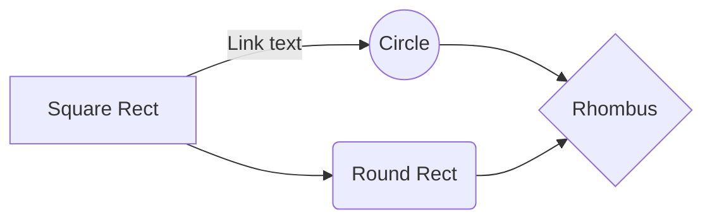

Extension for [Parsedown Extra](https://github.com/erusev/parsedown-extra)
==========================================================================

> Configurable Markdown to HTML converter with Parsedown Extra.

## Installation

Install the [composer package]:

    composer require adjmpwgt/parsedown-extra-plus ^0.0.0-beta-2

Or include `ParsedownExtraPlus.php` just after the `Parsedown.php` and `ParsedownExtra.php`

~~~ php
use Parsedown;
use ParsedownExtra;
use ParsedownExtraPlus;

$parser = new ParsedownExtraPlus();
$text = <<<EOD
```php
    echo $Parsedown->text('Hello _Parsedown_!');
```
EOD;
echo $parser->text($text);
~~~

~~~html
<pre class="prettyprint"><code class="language-php">
    echo $Parsedown->text('Hello _Parsedown_!');
</code></pre>
~~~

`pre.prettyprint` is a syntax highlighting class for `Google CodePrettify`.

The following script is required for syntax highlighting

```html
</script><script src="//cdn.jsdelivr.net/gh/google/code-prettify@master/loader/run_prettify.js"></script>
```

~~~text

~~~

```html
<pre><code class="mermaid">
graph LR
    A[Square Rect] -- Link text --> B((Circle))
    A --> C(Round Rect)
    B --> D{Rhombus}
    C --> D
</code></pre>
```

###### To deploy mermaid without a bundler, one can insert a `script` tag with an absolute address and a `mermaidAPI` call into the HTML like so:

```html
<script src="https://cdn.jsdelivr.net/npm/mermaid/dist/mermaid.min.js"></script>
<script>mermaid.initialize({startOnLoad:true});</script>
```

